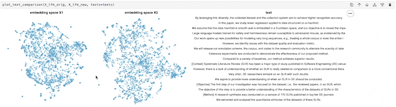

### cluestar

> Gain a clue by clustering!

This library contains visualisation tools that might help you
get started with classification tasks. The idea is that if you
can inspect clusters easily, you might gain a clue on what
good labels for your dataset might be!

It generates charts that looks like this:


There's even a fancy chart that can compare embedding techniques.



## Install

```text
python -m pip install cluestar
```

## Interactive Demo

You can see an interactive demo of the generated widgets [here](https://koaning.github.io/cluestar/).

You can also toy around with the demo notebook found [here](https://github.com/koaning/cluestar/blob/main/notebooks/overview.ipynb).

## Usage

The first step is to encode textdata in two dimensions, like below.

```python
from sklearn.pipeline import make_pipeline
from sklearn.decomposition import TruncatedSVD
from sklearn.feature_extraction.text import TfidfVectorizer

pipe = make_pipeline(TfidfVectorizer(), TruncatedSVD(n_components=2))

X = pipe.fit_transform(texts)
```

From here you can make an interactive chart via;

```python
from cluestar import plot_text

plot_text(X, texts)
```

The best results are likely found when you use
[umap](https://umap-learn.readthedocs.io/en/latest/)
together with something like
[universal sentence encoder](https://koaning.github.io/whatlies/api/language/universal_sentence/).

You might also improve the understandability by highlighting points
that have a certain word in it.

```python
plot_text(X, texts, color_words=["plastic", "voucher", "deliver"])
```

You can also use a numeric array, one that contains proba-values for prediction,
to influence the color.

```python
# First, get an array of pvals from some model
p_vals = some_model.predict(texts)[:, 0]
# Use these to assign pretty colors.
plot_text(X, texts, color_array=p_vals)
```

You can also compare two embeddings interactively. To do this: 

```python
from cluestar import plot_text_comparison

plot_text(X1=X, X2=X, texts)
```
